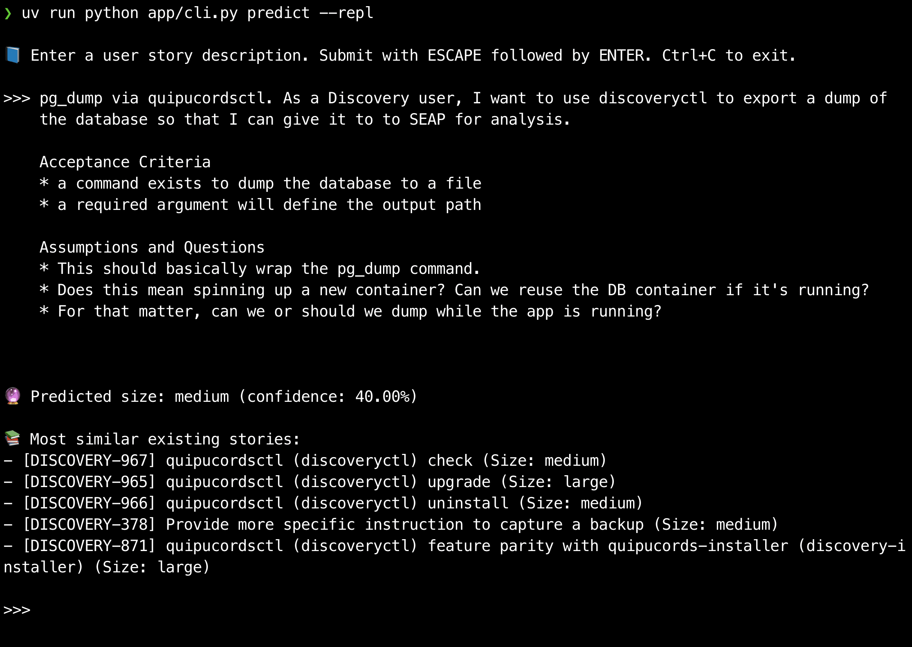

# AI/LLM/ML-based issue-estimating tool

See also: [DISCOVERY-942](https://issues.redhat.com/browse/DISCOVERY-942).



## Prereqs

* uv
* network access
    * to install python packages
    * to pull models from 🤗 Hugging Face
* optionally Ollama
    * to preprocess summarize descriptions into a more normal form
    * also needs network access to pull models
* Jira credentials or personal access token
    * if you want to scrape issues
    * `~/.jirasucks.json` looks like:
    ```
    {"prod": ["username", "yourpersonalaccessgoestokenhere"]}
    ```

## Usage

```sh
uv sync
uv run python app/jira_extractor.py > stories.json
uv run python app/cli.py train
uv run python app/cli.py predict --text "As a Discovery user, I want you to sudo make me a sandwich."
uv run python app/cli.py predict --repl
```
